# Independent panel queue

`panel-run` owns a separate SQLite database, conversation and private Unix socket
beside the Telegram database. `panel-bridge` sends a prompt and stable request ID
to that socket and waits for its result. Socket receipt wakes the worker directly;
idle workers do not poll. Persisted pre-dispatch retries use their due deadlines.

```mermaid
stateDiagram-v2
    [*] --> Queued: Authenticated gateway submits ID
    Queued --> Running: Worker wakes and claims
    Running --> Completed: Result persisted
    Running --> Queued: Safe pre-dispatch retry
    Running --> Uncertain: Possible action or interrupted process
    Running --> Failed: Definitive failure
    Completed --> [*]: Bridge reads result
    Uncertain --> [*]: Report; never replay automatically
    Failed --> [*]: Report error
```

A repeated ID retrieves the existing job. A caller timeout does not cancel or
resubmit it; retain the ID and check that same request. A full Telegram queue does
not consume panel capacity. Results never use the Telegram notifier. The same
Codex login is reused, with a fresh SDK connection per turn and a two-minute cap.
The persisted panel conversation survives between connections.

Panel turns use Codex directly. The inherited Telegram routing configuration is
cleared so this service does not instantiate a second Qwen/device worker or
supervisor. Telegram keeps its existing routing, review and learning behavior.
Both workers can act on the shared host, so this is queue isolation, not a global
physical-device lock. Deployment must authenticate the calling gateway and retain
existing adapter guards. No TCP service is exposed here.

Start the panel worker before calling `panel-bridge`. The socket and database are
private to the service account. A process lock refuses duplicate workers; restart
marks interrupted work uncertain. Panel service wiring remains owned by the
private deployment repository. Switching an existing deployment requires draining
its queue first; this PR does not deploy or replace that service.

Offline tests cover prompt/connection lifecycle, independent queue capacity,
no Telegram token requirement, event-driven completion and request-ID deduplication.
Existing shared-worker tests cover interruption, restart and uncertain execution.
