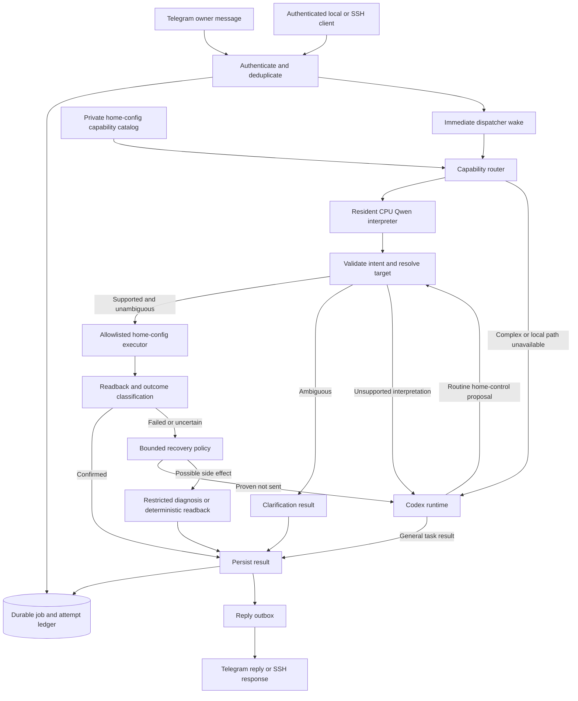
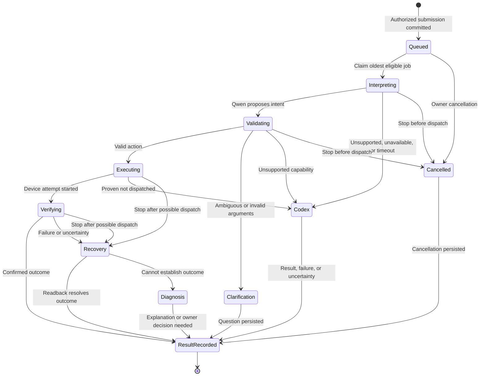
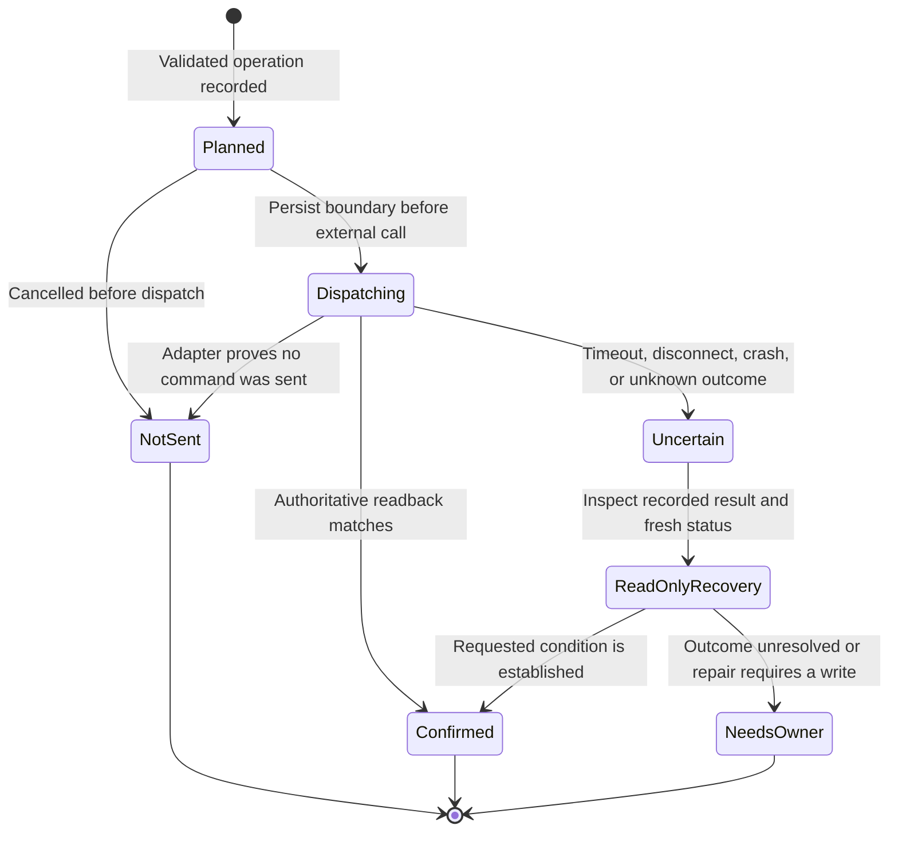
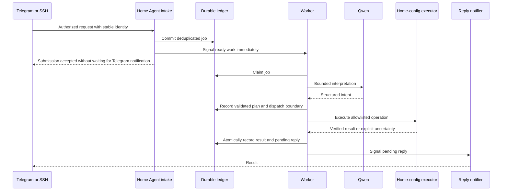
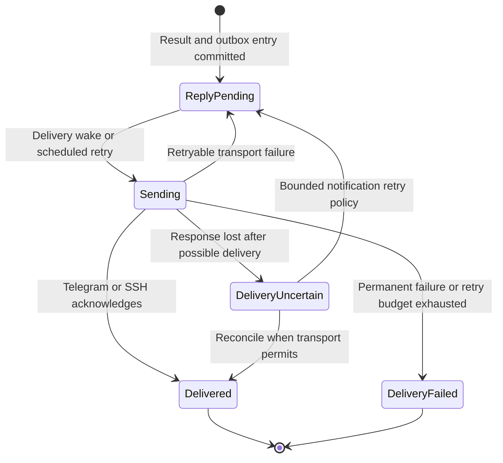

# Qwen-first home control with Codex fallback

Status: **approved design; production integration is not implemented yet**.

This document is the implementation architecture for the local-intent PR. The PR
currently provides a separate CPU Qwen experiment. Its socket worker demonstrates
latency and constrained execution, but is not the production Telegram router or a
durable queue. The sections below describe the intended integrated behavior.

Related documents: [behavior contract](../BEHAVIOR.md),
[security model](../SECURITY.md), [recovery](../RECOVERY.md), and
[reproducible experiment](../../experiments/local-intent/README.md).

## Decision and scope

Home Agent owns authentication, durable jobs, routing, execution state, and replies.
A resident Qwen model interprets routine home requests. Existing home-config
adapters validate and execute supported operations. Codex handles unsupported
requests and bounded recovery through the existing stable Codex Python SDK.
No additional agent framework is introduced.

The initial execution policy is one active job at a time, preserving ordered home
mutations. A long Codex turn can delay later controls; queue wait is measured
separately. Concurrent execution is a later decision requiring coordinated device
locks across both paths. The first release must not silently reorder commands to
make latency measurements look better.

| Capability family | Candidate local operations |
| --- | --- |
| Switches | Power on/off, status |
| Pool | Pump, cleaner, heating mode/setpoint, status |
| Hot tub | Setpoint, status |
| Climate | Heat/cool/off, setpoint, status |
| Gates/doors | Open/close, status |

This is an eligibility list, not a claim that every operation is already enabled
or verified. Enable each operation only after its argument rules, outcome
semantics, and language tests pass. Installation, configuration changes,
scheduling, complex multi-step work, and broad house-guide questions initially
use Codex. Ambiguous requests receive a clarification rather than a guessed action.

## Components and ownership

| Owner | Responsibilities |
| --- | --- |
| Public home-agent repository | Routing, job/attempt state, transport wakeups, model lifecycle, fallback policy, bounded context, metrics, synthetic tests, generic installation |
| Private home-config repository | Installed services, device aliases, native configurations, action adapters, parameter limits, outcome verification, deployment choices |
| Device CLIs | Vendor/device communication and their existing native control behavior |
| Qwen | Interpret a request into a constrained intent; no credentials, shell, or direct device access |
| Codex | General requests and recovery appropriate to the recorded execution phase |

Build the private catalog from home-config's existing inventory parser and adapter
contracts. Do not create a second service manifest or a replacement universal
device schema. An intent is a routing envelope whose arguments retain the relevant
service's native meanings. The executor exposes only specific named operations,
never arbitrary command strings. Reuse existing adapter logic rather than adding a
second implementation of the same device behavior in Home Agent.

Catalog entries contain stable target IDs, explicit aliases, supported actions,
argument types/units/ranges, and verification semantics. They exclude secrets and
are versioned. Cache the catalog; refresh it on a configuration-change event or
startup, not by rediscovering every device for every message. Revalidate against
the current catalog immediately before execution if its version has changed.

## Interpretation and validation

Qwen returns one of three schema-constrained decisions:

- `intent`: service, target, operation, and service-specific arguments;
- `clarify`: missing/ambiguous information and a small set of valid choices;
- `fallback`: unsupported request and a routing reason.

Use non-thinking inference with a short cached instruction prefix and a bounded
request/context budget. Start from the measured 2B model, but re-evaluate accuracy
and latency with the larger action catalog. A model's confidence statement never
authorizes an operation.

Validation checks the decision schema, configured service/target, allowed operation,
argument types, units, limits, and target resolution. The current experiment's
explicit-alias check becomes one part of this validation, not the whole policy.
Unknown targets or missing units that cannot be resolved from documented defaults
require clarification. Known invalid values cannot bypass validation by falling
back to Codex. Routine home-control proposals from Codex use the same executor and
validation rules. The routine fallback profile produces proposals through this
executor; it must not expose a second shell-based path around the policy. Keep
that profile distinct from explicit administrative requests with normal Codex
host authority.

Obvious administrative requests can go directly to Codex. For other requests,
allow one bounded Qwen attempt followed by at most one automatic Codex handoff;
never bounce between engines indefinitely. The local inference deadline is
configurable and tuned from measurements. Timeouts cancel/discard that generation
so it cannot later dispatch a command after fallback has begun.

## Durable job lifecycle

These are logical phases, not claims about the current SQLite schema. Retain the
existing job statuses (`queued`, `running`, `completed`, `failed`, `cancelled`,
`uncertain`) and add explicit routing/attempt records in a reviewed migration.
`Interpreting` through recovery are phases of a running job. Persisting the final
result sets the appropriate terminal status; delivery is tracked independently.

Clarification completes the current job with a question and records a bounded,
expiring pending question. It must not block the FIFO while waiting for the user.
The answer is a new authenticated job linked to that question and is revalidated.
A stale or conflicting answer cannot silently resume an old device action.

Store the original request, source identity/idempotency key, chosen engine,
catalog/model/prompt versions, intent, validation outcome, attempt number,
execution boundary, structured device outcome, result, and delivery state.
Preserve previous attempts when a user explicitly requests a retry.

## Side effects, recovery, and fallback

Persist the dispatch boundary before crossing it. A crash between that write and
the external call is conservatively uncertain; software cannot guarantee exactly
once physical execution across this boundary. An exception, nonzero CLI exit, or
model timeout alone is not proof that no device command was sent.

| Evidence | Allowed next step |
| --- | --- |
| Local model unavailable, invalid output, or timeout before execution | Codex gets the original request and routing reason |
| Ambiguous request | Ask for clarification; neither engine invents the target |
| Adapter proves preflight refusal/no dispatch | Codex may diagnose and propose a validated new attempt |
| Confirmed desired state | Record success; do not execute again |
| Possible dispatch with missing/mismatched readback | Read-only reconciliation; no automatic mutation replay |
| Completed action but lost Telegram reply | Retry delivery only |
| Both engines unavailable | Preserve the job/outcome and report a clear unavailable/failed state |

The same job ID accompanies the handoff. Codex receives the original request,
validated intent, exact attempts already made, structured errors, and readback.
Status observations distinguish current state from proof of what caused that
state. Readback indicating that a gate is still moving is not a failed command
and must not trigger another open/close attempt.

**Diagnosis-only recovery must be enforced outside the model.** The existing
unrestricted Codex runtime has shell access and passwordless sudo; a prompt asking
it to avoid writes does not constrain those powers. Implement a separate recovery
execution profile exposing only allowlisted reads, with no general shell,
mutating tool, writable device credentials, or privilege escalation. If the
available runtime cannot enforce that profile, keep automatic uncertain-action
recovery in deterministic readback code and ask the owner before further writes.
Do not reuse the unrestricted runtime for this purpose.

Explicit owner-authorized administration retains the existing Codex authority.
Its failure after dispatch also remains uncertain and must not replay. A model
error or fallback is not authorization to alter configuration or install software.
Cancellation prevents new execution and never automatically hands an interrupted
request to an unrestricted engine. Read-only reconciliation may explain a command
that was already sent.

## Immediate wakeup and independent delivery

All producers submit through the job-owning daemon. Telegram uses its in-process
submission API; SSH and heartbeat/timer clients use an authenticated private Unix
socket. Producers must not write directly to SQLite and depend on polling to
notice their inserts. Commit and signal in the owning process before the next
asynchronous yield; on daemon restart, drain persisted eligible work before
blocking. This covers a crash after commit but before notification.

Use stable submission IDs so a client can resolve a lost submission acknowledgement
without creating another job. The SSH client waits for a pushed completion or
subscribes to the existing job after reconnecting; it does not poll SQLite.

Drain ready jobs, then wait for an event or the next actual scheduled deadline.
Wake on submission, shutdown, configuration/authentication changes, and scheduled
retry deadlines. Arm one timer for the next due job; do not retain a periodic
queue sweep. Telegram long-polling may remain: an arriving update completes the
pending request immediately and adds no deliberate queue interval.

Move `Queued`/`Working` notifications off the execution path. A serialized per-job
notifier sends progress only after a configurable delay if no terminal result is
ready. It cancels stale progress and handles message IDs so an acknowledgement
cannot overwrite a final result. Notification failures never block device work.

Outbox failure/restart never transitions back to device execution. Prefer editing
an existing acknowledged Telegram message when available. Telegram send timeouts
can make delivery uncertain; do not promise exactly-once notification delivery.

## Context, model health, and availability

Keep a small persisted context per authorized conversation: recent resolved target,
last verified actions, and pending clarification. Include the relevant projection
in both Qwen interpretation and Codex handoff. Resolve pronouns only when a unique,
recent target exists. Treat old status as context, not current device verification.
`/new` clears conversational context when safe without deleting execution history.

Keep Qwen resident, isolate inference from credentials/device execution, and pin
runtime/model artifacts. Use request-driven health and a bounded circuit breaker:
repeated local failures temporarily route to Codex; after cooldown, allow one probe
or a single scheduled readiness attempt. Do not add periodic health polling to the
command path. Model downtime and Codex authentication are separate health states:
expired Codex login must not suspend otherwise eligible local home controls.

If the local path fails, use Codex. If Codex is unavailable too, do not hang or
silently retry uncertain work. Expose the job state and retain its evidence.
A job requiring an unavailable engine gets a bounded, explicit failure/deferred
result rather than holding the dispatcher indefinitely; do not globally pause
all jobs on a Codex authentication flag.
Model startup/loading is measured separately from a warm request.

## Outcomes, latency, and evidence

Replies describe what the adapter actually established. A confirmed setpoint is
not a claim that water/air has reached that temperature. A gate command accepted
is distinct from a gate fully open. Reuse existing adapter verification and
represent accepted, confirmed, failed-before-send, and uncertain outcomes
explicitly. Do not downgrade verification just to meet the latency target.

The target is approximately two seconds for an available worker handling a warm,
routine local request through verified completion. The CPU experiment measured
roughly one second for a single switch, not the expanded catalog or Telegram.
Physical movement, slow controllers, FIFO wait, and Codex fallback can take longer.

Record monotonic durations within each process and UTC timestamps for correlation:
receive, persist, claim, inference, validation, dispatch, device readback, result
commit, and reply delivery. Report queue wait separately, along with engine,
fallback reason, model/catalog versions, success rate, p50/p95, and cold/warm state.
Telegram message timestamps do not provide a millisecond-accurate measurement of
phone-to-bot delivery. Use host-receive-to-result and host-receive-to-Telegram-API
ack as separate metrics. Keep raw interaction evidence private.

## Implementation sequence and acceptance

1. Add the catalog/adapter contract in home-config and routing configuration in
   Home Agent. Keep existing native device configuration and manifest ownership.
2. Generalize persisted attempt/dispatch state beyond `codex_started`; add the
   result outbox, recovery migration, daemon submission API, and immediate wakeups.
3. Add Qwen interpretation, validation, bounded context, deadlines, and engine
   health separation. Preserve the Codex SDK path and existing owner checks.
4. Implement pre-dispatch fallback and enforced read-only reconciliation.
5. Run observation mode: classify alongside the existing path, record proposed
   decisions, and never execute a second action. Use synthetic/held-out language
   tests before evaluating private real-message evidence.
6. Enable tested local capabilities incrementally; keep unvalidated operations on
   Codex. Install supported services at boot through the normal release/deployment
   workflow after validation, replacing the separate experimental worker.

Required acceptance scenarios:

- Unauthorized, edited, forwarded, or duplicate Telegram updates do not execute.
- Explicit commands, aliases, units, negations, questions, conditional requests,
  multi-action requests, unknown devices, and follow-up context route correctly.
- No action is dispatched after its inference deadline, cancellation, or fallback.
- Every producer wakes an idle worker; concurrent commit/wait and restart races
  lose no jobs, and no periodic idle job polling remains.
- A model outage routes promptly to Codex; Codex login failure leaves local
  capabilities usable. Malformed Qwen output never reaches device execution.
- Fault injection before/after dispatch, after result commit, and during reply
  delivery preserves no-replay behavior and reconstructs pending notifications.
- Recovery cannot invoke mutating tools or acquire the normal Codex shell/sudo
  authority. Validation failures cannot be bypassed by fallback.
- Ordered actions remain ordered during fallback. Clarification does not hold the
  queue open. Notification failures and slow Telegram responses do not delay work.
- Adapter outcomes are truthful, including ongoing physical motion and uncertain
  readback. Language accuracy is reported separately from execution guard accuracy.
- Measure per-capability warm latency and queue contention with a meaningful sample;
  ten successful trials alone do not establish p95 reliability. Live device trials
  require explicit owner authorization; automated tests use substitutes.

Provide `codex-only`, `observe`, and `qwen-first` routing modes. Roll back new routing
by configuration without deleting jobs or results. Drain active attempts before
code/schema rollback; an older binary must not open an incompatible database.
Preserve uncertain attempts for reconciliation. Keep public source/tests free of
private catalogs, credentials, logs, and conversation transcripts.

The [behavior contract](../BEHAVIOR.md) describes current production behavior.
Update it alongside the implementation and its tests, rather than presenting this
design as already deployed. The existing Codex-only runtime guideline is extended
only for the explicitly approved local interpreter; Codex remains the general
agent runtime and no replacement framework is introduced.
