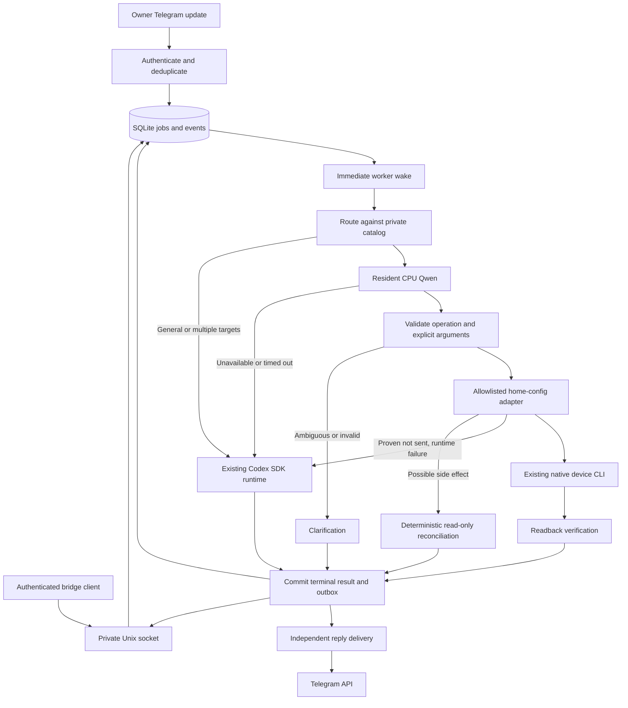
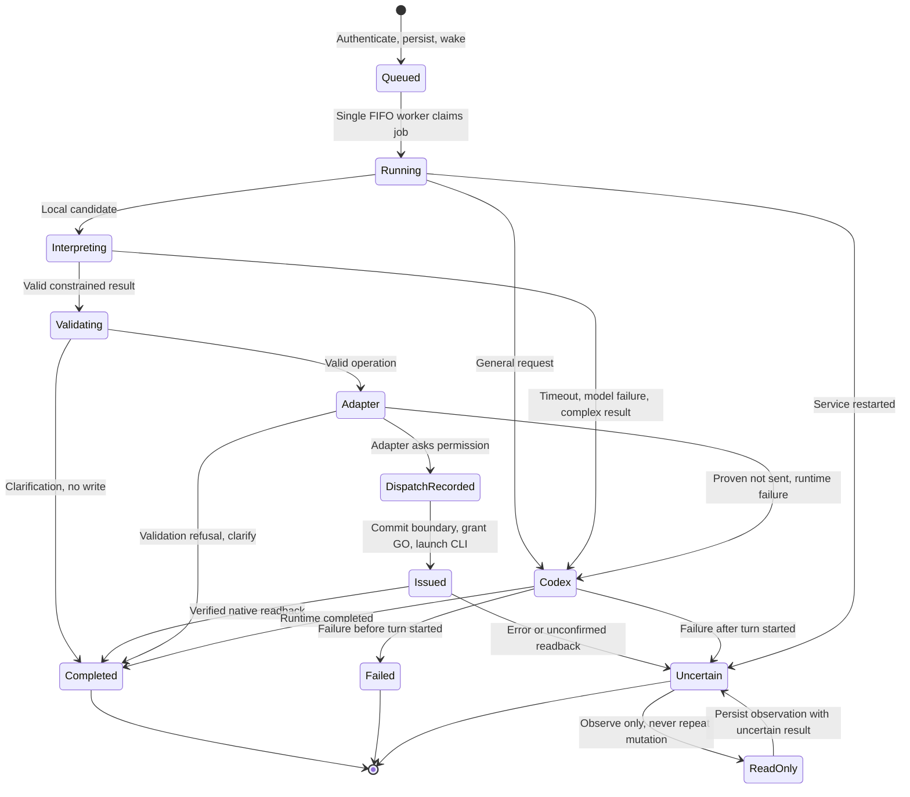
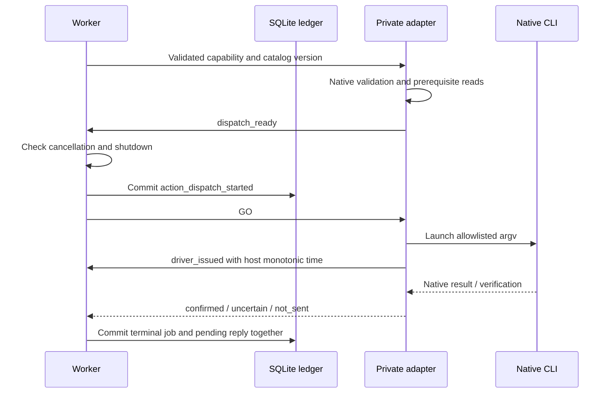
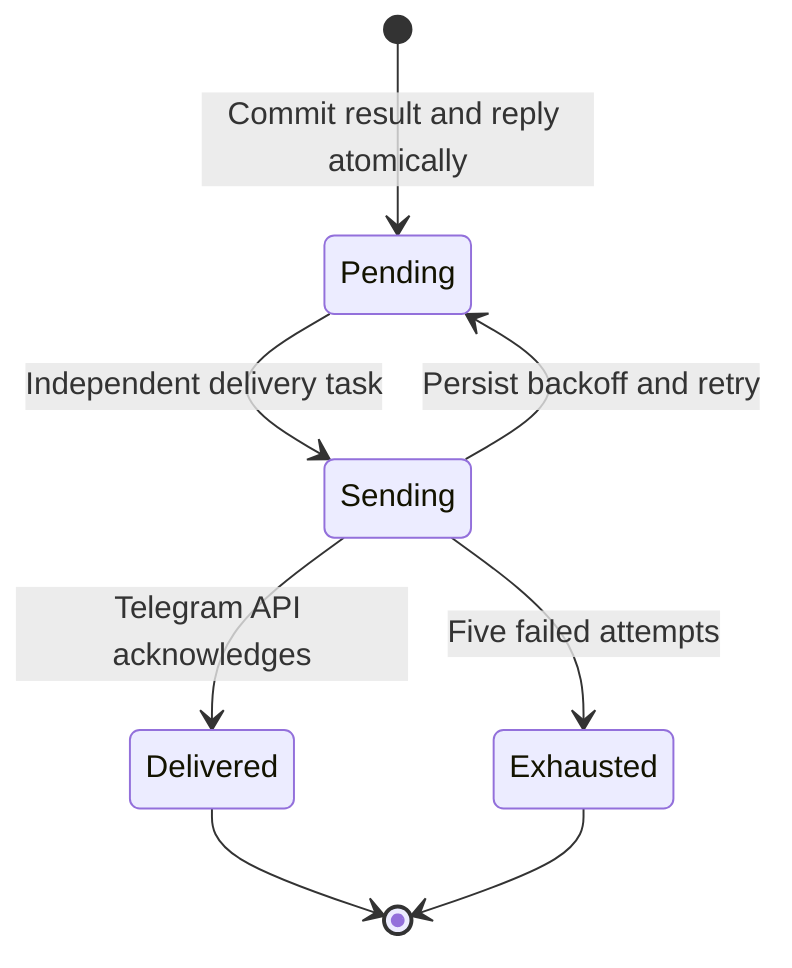

# Qwen-first home control with Codex fallback

Status: implemented by the local-Qwen PR; opt in using `[agent].routing_config`.
Deployment and measured acceptance results are recorded separately from the design.

Home Agent owns owner authentication, the durable FIFO queue, interpretation,
execution boundaries, replies, and performance evidence. A resident CPU Qwen
interpreter chooses one operation from the private home-config catalog. Existing
native adapters validate and execute it. The stable Codex Python SDK remains the
runtime for general tasks and fallback. There is no additional agent framework.

## Components and ownership



| Owner | Responsibility |
| --- | --- |
| Public home-agent | Authentication, durable jobs, wakeups, Qwen selection, validation, fallback, dispatch evidence, outbox, metrics, model installer |
| Private home-config | Inventory, aliases, native argument constraints, fixed adapter invocation, verification and household deployment |
| Native CLIs | Existing vendor/device protocols and credentials |
| Qwen | Select a schema-constrained operation ID; no tools or credentials |
| Codex | Existing trusted general-agent path, including its existing shell/sudo authority |

The private catalog is generated using home-config's `bin/inventory` parser and
existing panel adapters. It is a cached routing projection, not a replacement
service manifest or universal device configuration. Refresh and restart routing
when configuration changes. Both sides check a catalog version before execution.
The model service runs as `home-agent-model`, separate from the credential-bearing
adapter account. It binds only to loopback and has no device tools.

## Local interpretation contract

Catalog families are switches (on/off/status), climate (heat/cool/off/setpoint/status),
pool (pump/cleaner/heating/status), hot tub (setpoint/status), and gates (open/close/status).
Only configured operations in the inventory action allowlist become capabilities.

1. Match explicit device aliases with word boundaries. Prefer a longer alias over
   a shorter overlapping alias, but retain distinct targets elsewhere in the message.
2. Multiple targets or compound requests use Codex before any local dispatch.
3. Qwen returns only `{"op": N}`: a candidate operation number, `0` for clarification,
   or `-1` for complex work. Schema-constrained output is limited to 12 tokens.
4. Code extracts an explicit numeric temperature or named heating mode. Validate
   the native unit, bounds and whole-degree requirement; never invent a setpoint.
   This first release supports Fahrenheit locally; Celsius requests ask for clarification.
5. Reject negated, conditional, explanatory, and deferred local writes. Missing or
   invalid arguments produce clarification, not a fallback that bypasses validation.
6. Invoke a fixed executable argv with JSON over stdin. Model output never becomes
   shell text, an executable path, or an arbitrary tool name.

No local pronoun or conversation-memory inference is enabled. Requests need an
explicit device alias; broader conversation uses the existing Codex thread.
Follow-up/context sharing and richer language coverage remain future work.
The general Codex path retains its prior trusted execution contract: it does **not**
currently route all shell actions back through the local validator. Its device
issue timings and independent readback cannot be inferred from its final prose.

## Queue and execution state



A local mutation uses a framed handshake:



`action_dispatch_started` means a side effect may occur; `driver_issued` means the
CLI process was actually launched. Neither means hardware acknowledgement.
After possible dispatch there is no unrestricted Codex fallback or automatic
mutation replay. Reconciliation uses the adapter's enforced read-only path and
cannot receive GO permission. It reports the current observation but conservatively
leaves the original result uncertain. Restarted running jobs also stay uncertain;
manual `/retry` remains an explicit owner action. Queued jobs resume on startup.

The single worker preserves order across local and Codex requests. Long Codex
turns and slow physical devices can block subsequent commands; measure queue wait
rather than silently reordering work. Device preflight reads also count toward
issue latency. Inference has a 1.5-second timeout; three failures open a request-driven
30-second circuit breaker. No late inference result can dispatch after fallback.
Codex authentication failure does not block eligible local requests.

## Wakeups and reply delivery

Telegram enqueues and wakes in the daemon without awaiting a Telegram API call.
Bridge clients use a mode-0600 Unix socket with stable request IDs; retrying the
same ID retrieves the same job. The daemon persists and wakes before acknowledging
submission. CLI heartbeat producers also submit through this socket. A socket lock
prevents a second daemon from unlinking an active endpoint. Deployment controls
wake the worker after changing pause state.

In routing mode, an idle worker waits on events indefinitely. A queued retry uses
its exact due time as a timer. There is no periodic idle queue polling. Telegram's
normal server-side long polling remains the network transport and is unrelated
to local queue polling. Legacy operation without `routing_config` retains its
prior behavior for compatibility.



Delivery failures never rerun the device job. Retry state survives restart.
Telegram may have delivered a message whose API acknowledgement was lost, so
notifications are not promised exactly once. Exhausted deliveries remain in the
outbox and event log for inspection. Fast-path messages receive a final reply
without an extra queued/working round trip. Slow jobs can be inspected with
`/status`; a delayed progress notification is not implemented in this release.

## Performance evidence and goals

The objectives are **greater than 99% verified success** for eligible basic controls
and **less than 1,000 ms from daemon receipt to command issue**. Durable acceptance
is measured separately and should also remain below 1,000 ms. Verified completion
and Telegram delivery remain separate measurements; physical motion is not expected
to finish within a second. These are targets, not a claim established by deployment.

| Field/event | Meaning |
| --- | --- |
| `performance_accepted.accept_ms` | Host receipt to durable queue acceptance |
| `queue_ms` | Receipt to worker claim, including acceptance |
| `inference_ms`, `interpreted.decision.model_timings` | Total local HTTP inference; llama prompt/cache/generation timings |
| `validated` | Argument validation finished |
| `action_dispatch_started` | Durable possible-side-effect boundary before GO |
| `driver_issue_ms` | Host receipt to actual native CLI process launch |
| `driver_issue_from_claim_ms` | Claim to CLI launch, excluding queue backlog |
| `device_ms` | Adapter lifetime, including native prerequisite reads and verification |
| `completed_ms` | Receipt to terminal processing completion; excludes reply delivery |
| `performance_delivery.delivery_ms` | Telegram API request duration |
| `performance_delivery.receipt_to_reply_ms` | Receipt to Telegram API acknowledgement |

Events carry UTC timestamps and same-host monotonic durations, boot ID, job ID,
attempt, engine, model, catalog version, release, outcome and fallback reason.
Model cold/prompt-cache behavior is available in native inference timings. Boot
changes invalidate receipt-relative monotonic timings. Logs contain structured
performance summaries in the service journal and detailed events in the existing
private SQLite interaction ledger. Summaries exclude prompts and credentials.
Never publish raw logs, catalogs, or transcripts to the public repository.

```sh
sudo -u home-agent /opt/home-agent/current/venv/bin/agentctl performance \
  --since 2026-09-20 --source telegram
sudo -u home-agent /opt/home-agent/current/venv/bin/agentctl performance \
  --since 2026-09-20 --source benchmark
journalctl -u home-agent.service --grep='performance job_id='
```

Reports separate source and capability/engine, use the latest attempt per job,
and show success counts, latency sample counts, p50/p95/max, clarification and
fallback counts. Clarifications are excluded from actionable success but displayed
separately. Unknown/crashed outcomes and missing timings are not passes. Codex
completion without independent device verification does not count as verified
success. Read-only observations do not enter mutation issue-latency denominators.
Raw attempts remain available so explicit retries are not hidden.

Report language selection accuracy separately from execution success. Review
clarification/fallback rates alongside reliability to avoid making success look
better by refusing supported requests. Use both repeated warm commands and mixed
capabilities, and separate idle-worker trials from queue contention. Telegram
message dates cannot measure millisecond phone-to-host latency. Small samples
cannot substantiate >99% reliability: even 100/100 successes are insufficient to
establish that threshold with a one-sided 95% lower confidence bound.

## Installation, tests, and rollback

The generic installer `scripts/install-local-model.py` verifies the pinned runtime
and model checksums and installs the isolated, boot-enabled system service.
It may reuse verified artifacts from the experiment cache. The private repository
provides `bin/install-home-agent-router` for catalog/adapters and routing configuration.
Stop the obsolete experimental user services before starting the system model.
The regular public release remains the source of the Telegram worker code.

Tests cover real Unix-socket wakeups and idempotent submission, authenticated
Telegram intake and asynchronous delivery, model failure, Codex auth isolation,
pre-dispatch guards, uncertain read-only recovery, restart evidence, and durable
outbox retry. home-config tests run the framed adapter against substitute native
CLIs and verify permission, dispatch and readback boundaries. Live mutation trials
are restricted to owner-authorized devices; do not use gates/heaters merely to
increase sample counts.

Use `mode: "codex-only"` and restart to disable local routing while retaining the
new queue and outbox. `observe` records eligible proposals and then uses Codex
without local dispatch. Drain active work before binary rollback, retain a database
backup, and preserve uncertainty evidence. The schema migration is additive; do
not delete jobs or outbox rows as a rollback mechanism.

The [initial deployed baseline](qwen-baseline.md) records the measured sample and
its limits; it does not replace the reliability objectives above.
