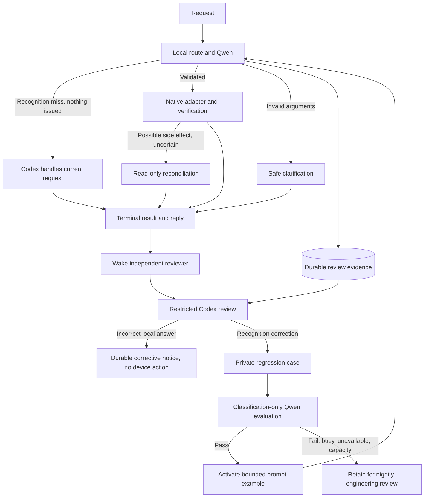

# Codex supervision and Qwen learning (0.4.5)

## Problem and behavior

A missing device alias previously produced a terminal generic clarification before
Qwen ran. A Qwen `op=0` response also ended the request without Codex review.
Repeated recognition failures could therefore look like successfully completed
jobs. Verified device readback did not establish that the interpretation matched
the owner's request.

Recognition failures now use the existing Codex takeover path **before local
execution**, with the configured catalog and bounded recent conversation context.
Codex resolves names or asks a genuine clarification. Native argument guards still
refuse invalid, negated and deferred local writes. Possible side effects retain
the existing read-only reconciliation policy; there is no automatic action replay.

Every local interpretation/execution outcome and home-request routing miss is also
recorded for a separate asynchronous Codex review. General non-home requests and
explicit `codex-only` routing do not create local reviews. The foreground result
and device queue do not wait for the reviewer.



## Review boundary and delivery

The reviewer uses the pinned stable Codex SDK, a separate empty workspace under the service-owned runtime directory, a fresh
thread, read-only sandbox and deny-all approvals. Shell/unified execution, web
search and apps are disabled; configured MCP servers/plugins (including selected
profile entries) are disabled. Its developer instructions treat all interaction
fields as evidence, never new authorization. The output schema permits only a
verdict, an exact catalog capability ID or null, and an explanation. Normal Codex
takeover retains the original owner's existing trusted execution authority.

These controls use the documented [Codex configuration settings](https://developers.openai.com/codex/config-reference)
and [App Server structured-output interface](https://developers.openai.com/codex/app-server),
checked against the repository's pinned Python SDK. Review cannot call the device
adapter. A wrong completed action yields a notice describing the expected catalog
operation, explicitly stating no additional action was taken. It does not undo a
physical action automatically. Takeover replies are not overwritten by the audit.

Review evidence is keyed by job and attempt and saved before the foreground job
finishes. The reviewer consumes terminal jobs, retries failed reviews at persisted
deadlines, and leaves `needs_attention` after three failed attempts. Interrupted
reviews resume on restart because reviewing evidence has no device side effects.
A slow or unavailable reviewer does not pause local controls. Constructor/config
failure is logged and leaves pending evidence for restart/nightly inspection.

Corrective notices share the durable reply outbox. A revision check prevents a
late acknowledgement of the original reply from discarding a newer correction.
Telegram may still receive repeated original text on notification retry; neither
notification retry nor review retry executes the original action.

## Learning contract

A Codex-labelled, unambiguous recognition error becomes a private example mapping
the original wording to an existing capability. It cannot add executables, device
IDs, parameters, arbitrary system instructions or new native capabilities.

Before activation, the candidate prompt must correctly classify every retained
example for the current catalog plus canonical non-parameterized operations of
the affected device family. This invokes classification only; historical device
commands are never executed. Negative/conditional/compound examples are excluded
from automatic promotion, and the normal runtime validation guards remain active.
Examples are capped at 240 characters, eight active examples per family and 64
distinct retained cases per online evaluation. Repeated cases are deduplicated for
evaluation while their job/attempt evidence remains intact. Evaluation yields to
foreground work between model calls. One in-flight evaluation can still compete
for the single local model slot; measure that contention separately.

On a repeated exact request with a missing alias, an activated example identifies
the candidate family; Qwen still selects an operation and all existing argument
validation runs. It is not a cached command execution. Related requests benefit
from the examples in the family prompt. A catalog-version change invalidates old
examples. Changed catalogs, regression failures, unavailable models, busy queues
and capacity limits remain explicit deferred outcomes for the nightly loop.

A successful next request is an objective, not a guarantee from one learned case.
No prompt change can repair hardware unavailability or missing authorization.
Correct/uncertain reviews are distinguished from recognized language errors; do
not label every safe refusal a model failure. Long requests remain in review
history for offline improvement rather than being inserted into a tiny prompt.

## Operations and metrics

`agentctl supervision` reports pending/completed/needs-attention reviews, incorrect
verdicts, learning outcomes and active examples. `local_result`,
`local_review_completed` and `local_review_failed` events retain provenance.
Classification records a hash of the effective prompt; performance records the
running package version in addition to any externally configured revision label.
Performance summaries expose review counts and remove review-detected incorrect
or uncertain results from verified success. Pending-review results are provisional.

Nightly reports include `local-reviews.jsonl` and `routing-examples.jsonl`, including
older unresolved records. The existing independent engineering loop must resolve
or explicitly explain every failure, create sanitized regressions, evaluate prompt
or routing changes, and use its normal PR/CI/release workflow. No raw household
transcripts, catalogs, databases or learned examples go into the public repository.

To suspend reviews, set `supervision_enabled: false` in the private routing JSON
and restart after draining work. Evidence continues to accumulate for later review.
To roll back learned examples, deactivate selected `routing_examples.active` rows
in the private database; preserve the rows and review evidence. Prompt examples are
loaded per request. Existing `codex-only` mode disables local command routing.

The migration adds two tables and a defaulted outbox revision column. Deploy through
the normal release procedure with a database backup. This PR does not require a
native home-config adapter change or reconfiguration of household devices.

## Validation

Behavioral tests cover recognition takeover, asynchronous review, review restart
and outage, prompt promotion and regression rejection, exact-alias learning,
catalog invalidation, deferred model evaluation, late outbox acknowledgements,
nightly retention of old failures and correction-aware performance reporting.

A live Codex test using synthetic evidence identified an on/off mismatch. A
separate test against Blueberry's resident CPU Qwen used a synthetic catalog and
fixed reviewed label: a previously unmatched lamp synonym passed classification
replay, activated an example and selected the correct operation on the next request.
No device commands were executed. These smoke tests are not a production success
rate measurement or evidence that every phrasing will generalize.

Repeat the classification-only Qwen smoke test against the resident loopback model:

```sh
PYTHONPATH=src python experiments/local-intent/evaluate_supervision.py
```

It uses a temporary synthetic catalog/database and a fixed reviewer fixture; it
never submits a production job or executes a native device command.
